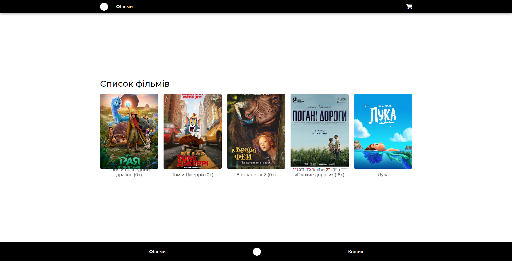
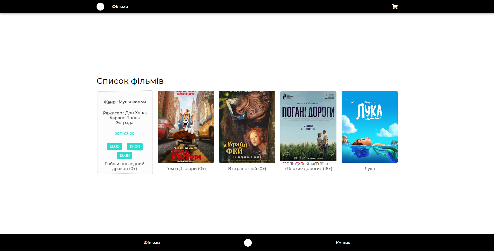
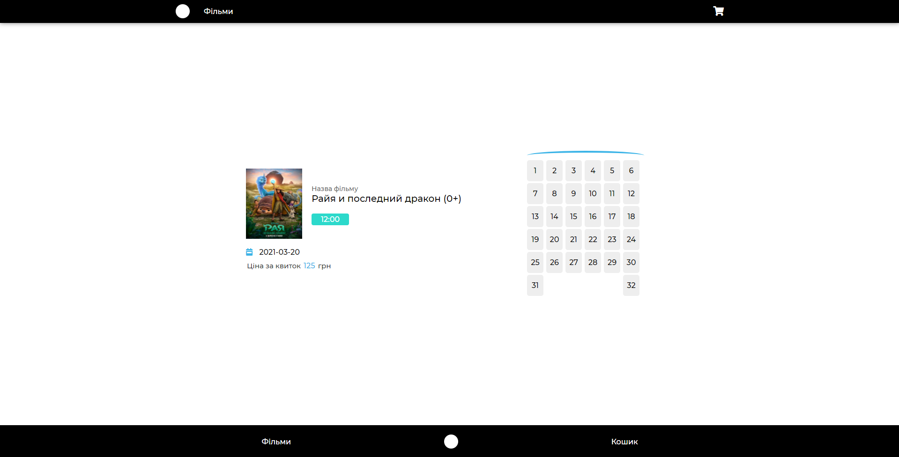
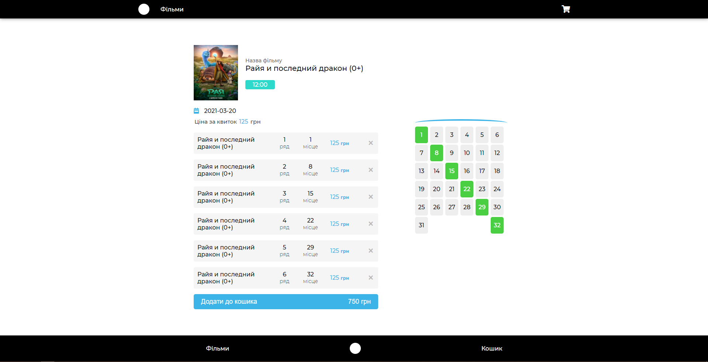
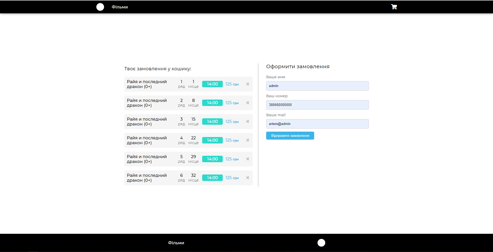
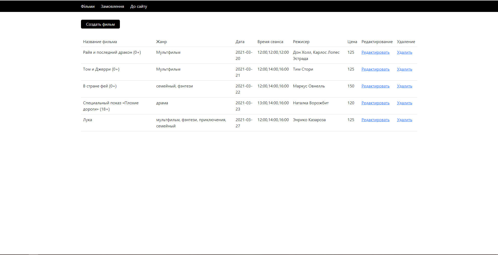
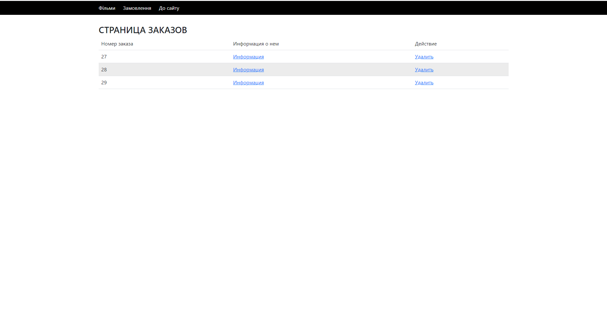
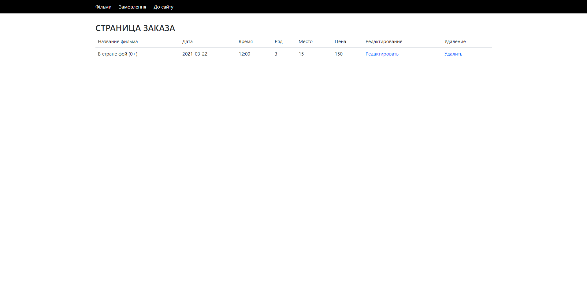

# cinema
Coursework

DB: mysqli
file db: films.sql
<H5>Главная</H5>

<H5>Главная</H5>

<H5>Фильм</H5>

<H5>Фильм</H5>

<H5>Корзина</H5>

<H5>Admin Панель (страница фильмов)</H5>

<H5>Admin Панель (Страница заказов)</H5>

<H5>Admin Панель (Страница заказов 'информация')</H5>

